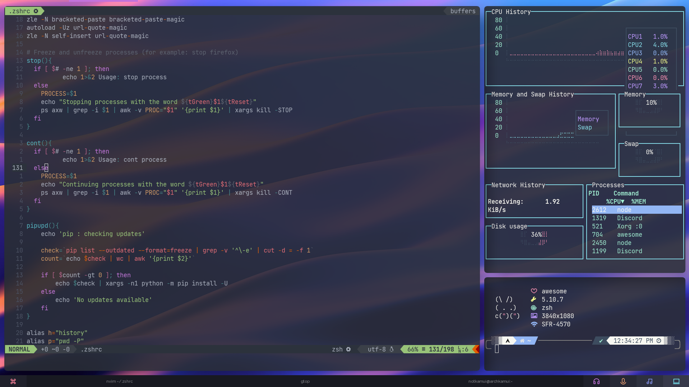

# My .dotfiles


## Summary

*   [Introduction](#Introduction)
*   [Gallery](#Gallery)
*   [Dependencies](#Dependencies)
*   [Installation](#Installation)

## Introduction

Dotfiles are usually hidden config files that are easily transportable and
sharable between installations of *nix operating systems.

Mine are a collection of little things everywhere that make up a fully fledged
and development oriented setup.

## Gallery




## Dependencies

soon<sup>tm</sup>

## Installation

> To be used on a fresh install.
> Make sure to get every dependencies beforehand.

### Step 1: make the magic alias

The goal is to create and get an alias for a bare git repo. The alias to access
it is `dotfiles` instead of plain `git`. It avoids conflict with other git repos
in your ~/ folder.

```Bash
echo "alias dotfiles='/usr/bin/git --git-dir=$HOME/.dotfiles --work-tree=$HOME'" >> $HOME/.zshrc
```

Don't forget to launch a new shell to update the modifications.

### Step 2: hide the .dotfiles folder from git

Create a .gitignore and ignore .dotfiles

```Bash
echo ".dotfiles" >> .gitignore
```

### Step 3: clone my .dotfiles

Yank everything !

```Bash
git clone --bare https://github.com/notKamui/dotfiles $HOME/.dotfiles
```

### Step 4: checkout to the config

Apply the config.

```Bash
dotfiles checkout
```

If there's an error message, it's probably due to an existing .zshrc or
.gitignore. If so, yeet them and checkout again.\
Then, hide the untracked files.

```Bash
dotfiles config --local status.showUntrackedFiles no
```

### Step 5: update the cache

You need to update the cache to make sure the fonts in .fonts are installed properly

```Bash
fc-cache -v
```
